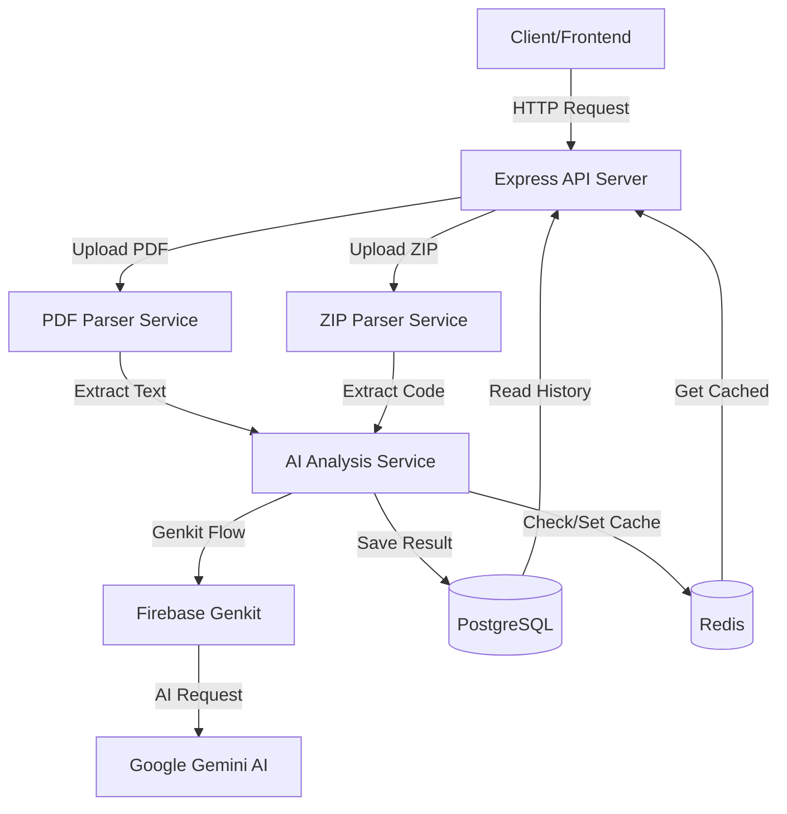
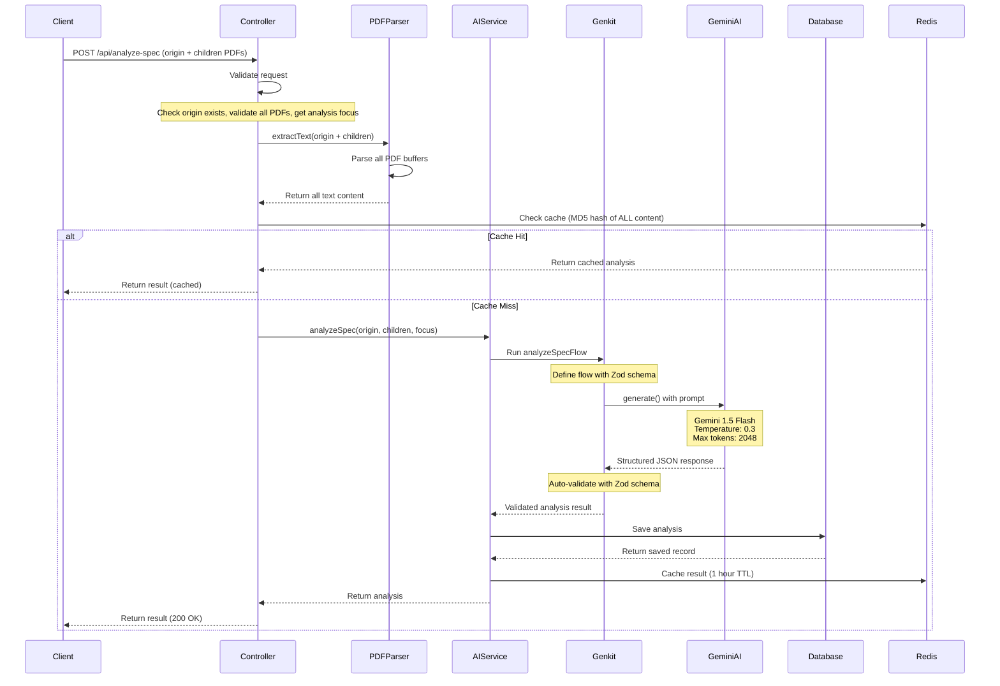
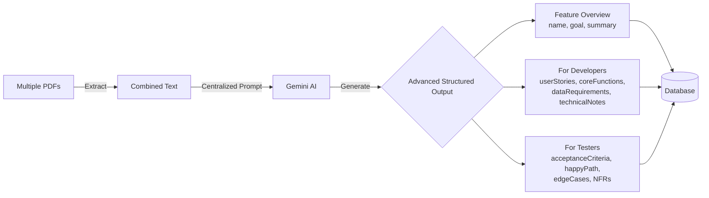
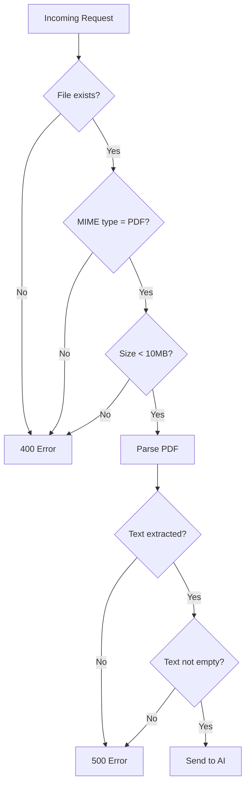
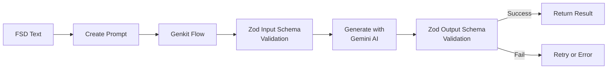
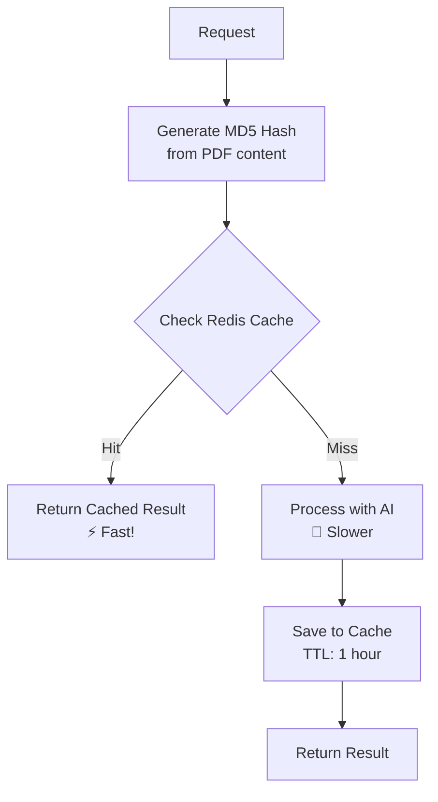

# 📖 Tổng quan dự án DevInsight AI - Backend

## 🎯 Giới thiệu

**DevInsight AI Backend** là hệ thống API phục vụ cho ứng dụng DevInsight AI - một trợ lý AI toàn diện giúp developers phân tích tài liệu và tự động tạo documentation.

### Mục tiêu chính

1. **Phase 1 - AI Spec Analyzer**: Phân tích nhiều file FSD (Functional Specification Document) cùng lúc và tự động tạo advanced analysis cho Developers và Testers
2. **Phase 2 - AI Code Review Assistant**: Review code changes với AI trong context của toàn bộ codebase, phát hiện bugs, performance issues, security vulnerabilities

## 🏗️ Kiến trúc tổng thể

### High-Level Architecture



## 📊 Phase 1: AI Spec Analyzer - Flow Diagram

### Chi tiết luồng xử lý FSD



### Cấu trúc dữ liệu (Advanced)



## 🔄 Cách API hoạt động

### 1. Request Flow

```
Client Request
    ↓
Express Middleware (CORS, body-parser, file-upload)
    ↓
Router (/api/analyze-spec)
    ↓
Controller (specAnalyzer.controller.ts)
    ↓
Service Layer (pdfParser + aiAnalysis)
    ↓
Genkit Flow (with Gemini AI)
    ↓
Database (PostgreSQL) + Cache (Redis)
    ↓
Response to Client
```

### 2. Validation Pipeline



### 3. AI Processing Flow



### 4. Caching Strategy



## 📦 Database Schema

### Phase 1: PostgreSQL (Prisma)

```prisma
model SpecAnalysis {
  id               String   @id @default(uuid())
  fileName         String
  fileSize         Int
  analysisFocus    String?  @db.Text
  analysisResult   Json?    // Main analysis data
  createdAt        DateTime @default(now())
  updatedAt        DateTime @updatedAt

  @@map("spec_analyses")
}
```

### Phase 2: Redis Only

- **Context Storage:** `project_context:{contextId}` - TTL 24h
- **Metadata:** `project_context_meta:{contextId}` - TTL 24h
- **Review Cache:** `code_review:{hash}` - TTL 1h

## 🎯 API Endpoints

### Module 1: AI Spec Analyzer

#### 1. Phân tích FSD (Multi-document)
```http
POST /api/analyze-spec
Content-Type: multipart/form-data

Body:
- origin: File PDF gốc (required, max 10MB)
- children: File(s) PDF con (optional, multiple files)
- analysisFocus: Trọng tâm phân tích (optional, string)
```

**Response:**
```json
{
  "success": true,
  "data": {
    "id": "uuid",
    "fileName": "main-spec.pdf, api-spec.pdf",
    "analysisFocus": "Authentication and security",
    "analysis": {
      "featureOverview": {
        "name": "User Authentication System",
        "goal": "Help users login securely",
        "summary": "JWT-based authentication with RBAC"
      },
      "forDevelopers": {
        "userStories": ["As user, I want to login..."],
        "coreFunctions": ["Implement JWT auth", "Create login/logout endpoints"],
        "dataRequirements": "Input: email, password. Output: JWT token",
        "technicalNotes": ["Use bcrypt for password hashing"]
      },
      "forTesters": {
        "acceptanceCriteria": ["Given valid credentials, return JWT token"],
        "happyPath": "User login → Validate → Generate JWT → Return token",
        "edgeCasesAndRisks": ["Weak password", "Brute force attack"],
        "nonFunctionalRequirements": "Response < 500ms, 99.9% uptime"
      }
    },
    "createdAt": "2024-01-15T10:30:00.000Z"
  }
}
```

#### 2. Lịch sử phân tích
```http
GET /api/analyze-spec/history?limit=10&offset=0
```

#### 3. Chi tiết một phân tích
```http
GET /api/analyze-spec/:id
```

### Phase 2: AI Code Review Assistant

```http
# Step 1: Upload codebase
POST /api/code-review/upload-context
Body: codebase (ZIP, max 50MB)

# Step 2: Review changes  
POST /api/code-review/review-changes
Body: contextId, changeDescription, changes (ZIP/PATCH)

# One-step review
POST /api/code-review/quick-review
Body: codebase (ZIP), changes (ZIP/PATCH), changeDescription

# Get context info
GET /api/code-review/context/:contextId
```

**Response Structure:**
```json
{
  "review": {
    "overallQuality": "string",
    "summary": { "totalIssues": 5, "criticalIssues": 1 },
    "potentialBugs": [{"file", "line", "severity", "issue", "suggestion"}],
    "performanceIssues": [...],
    "securityVulnerabilities": [...],
    "conventionViolations": [...],
    "improvements": [...],
    "positivePoints": ["..."]
  }
}
```

**See [Phase 2 API Documentation](./07-phase2-api.md) for details.**

## ✨ Key Features

- **AI Model:** Gemini 2.5 Pro (configurable)
- **Framework:** Firebase Genkit 1.21.0
- **Structured Output:** Zod schema validation
- **Caching:** Redis (TTL: 1h for reviews, 24h for context)
- **File Support:** PDF (10MB), ZIP (50MB), PATCH/DIFF
- **Dev Tools:** Genkit Dev UI at http://localhost:4000

## ⚡ Performance

| Operation | Time |
|-----------|------|
| PDF Parsing | < 2s |
| AI Analysis | 5-15s |
| Cache Hit | < 100ms |
| Total (cached) | < 200ms |
| Total (new) | 7-20s |

## 🔒 Security

- **File Validation:** Type, size, MIME checking
- **Size Limits:** PDF 10MB, ZIP 50MB
- **Input Sanitization:** All inputs validated
- **Env Protection:** API keys in .env only

## 🎓 Tài liệu liên quan

- [Tech Stack](./02-tech-stack.md) - Chi tiết công nghệ sử dụng
- [Getting Started](./03-getting-started.md) - Hướng dẫn setup
- [Phase 1 Guide](./04-phase1-guide.md) - Giải thích code chi tiết
- [Genkit Guide](./05-genkit-guide.md) - Hướng dẫn Genkit
- [Phase 2 Guide](./06-phase2-guide.md) - AI Code Review Assistant
- [Phase 2 API](./07-phase2-api.md) - API Documentation
- [Phase 2 Testing](./08-phase2-testing.md) - Testing Guide
